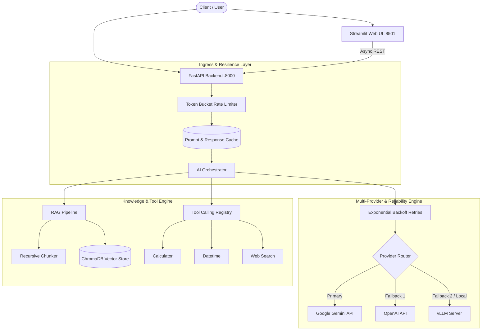

# 🤖 Enterprise AI Assistant & Production AI Engineering Suite

[](https://fastapi.tiangolo.com)
[](https://streamlit.io)
[](https://www.trychroma.com/)
[](https://www.docker.com)
[](https://python.org)

A complete, production-ready AI Assistant system engineered for **Week 15: Applied AI & Engineering AI Systems**.

---

## 📋 Table of Contents
1. [Overview & Highlights](#-overview--highlights)
2. [System Architecture](#-system-architecture)
3. [Assignment Requirements Matrix](#-assignment-requirements-matrix)
4. [Quickstart Guide](#-quickstart-guide)
5. [Interactive Web UI (Streamlit)](#-interactive-web-ui-streamlit)
6. [API Reference & Examples](#-api-reference--examples)
7. [Reliability & Resilience Engineering](#-reliability--resilience-engineering)
8. [Model Optimization & ONNX Analysis](#-model-optimization--onnx-analysis)
9. [Running Tests](#-running-tests)
10. [Cloud Deployment (AWS, GCP, Azure)](#-cloud-deployment-aws-gcp-azure)

---

## 🌟 Overview & Highlights

- **Multi-Provider LLM Engine:** Seamlessly interfaces with **Google Gemini**, **OpenAI**, **Local vLLM (Llama 3 / Mistral)**, and **Mock** providers.
- **RAG Subsystem:** Recursive text chunking, dense embeddings (`all-MiniLM-L6-v2`), persistent **ChromaDB** vector storage, and source citation synthesis.
- **Extensible Tool Calling:** Dynamic function execution registry with schema extraction for tools (e.g. calculator, time resolution, simulated web search).
- **Resilience Engineering:** Token-bucket rate limiting ($60\text{ req/min}$), exponential backoff retries with randomized jitter, and automated multi-tiered provider failovers.
- **High Performance:** Deterministic SHA-256 prompt/response caching, asynchronous request concurrency with FastAPI.
- **Enterprise UI:** Interactive Streamlit web interface with document ingestion, live hyperparameter tuning ($T, \text{top\_p}$), citation viewers, and tool call logs.

---

## 🏛️ System Architecture



---

## 📑 Assignment Requirements Matrix

### Task 1: Build an AI Assistant (Applied AI)
| Requirement | Status | Implementation File |
| :--- | :---: | :--- |
| **LLM Integration** (Gemini, OpenAI, vLLM) | ✅ | [`app/core/llm_provider.py`](file:///c:/Users/acer/Desktop/week15/app/core/llm_provider.py) |
| **Prompt Engineering & Parameter Tuning** | ✅ | [`app/config.py`](file:///c:/Users/acer/Desktop/week15/app/config.py), [`app/main.py`](file:///c:/Users/acer/Desktop/week15/app/main.py) |
| **Structured Output (JSON schema validation)** | ✅ | [`app/core/structured_output.py`](file:///c:/Users/acer/Desktop/week15/app/core/structured_output.py) |
| **Tool Calling / Function Calling** | ✅ | [`app/tools/registry.py`](file:///c:/Users/acer/Desktop/week15/app/tools/registry.py), [`app/tools/builtins.py`](file:///c:/Users/acer/Desktop/week15/app/tools/builtins.py) |
| **RAG Pipeline (Ingestion, Chunking, Vector DB)** | ✅ | [`app/rag/ingestion.py`](file:///c:/Users/acer/Desktop/week15/app/rag/ingestion.py), [`app/rag/vector_store.py`](file:///c:/Users/acer/Desktop/week15/app/rag/vector_store.py) |
| **Local Deployment via vLLM** | ✅ | [`docs/model_optimization.md`](file:///c:/Users/acer/Desktop/week15/docs/model_optimization.md) |
| **Containerization (Dockerfile)** | ✅ | [`Dockerfile`](file:///c:/Users/acer/Desktop/week15/Dockerfile) |

### Task 2: Productionize the AI Assistant (Engineering AI Systems)
| Requirement | Status | Implementation File |
| :--- | :---: | :--- |
| **Web UI (Streamlit)** | ✅ | [`app/ui/streamlit_app.py`](file:///c:/Users/acer/Desktop/week15/app/ui/streamlit_app.py) |
| **Model Optimization & ONNX Justification** | ✅ | [`docs/model_optimization.md`](file:///c:/Users/acer/Desktop/week15/docs/model_optimization.md) |
| **Async Concurrency & Latency Optimization** | ✅ | [`app/main.py`](file:///c:/Users/acer/Desktop/week15/app/main.py) |
| **Prompt/Response Caching** | ✅ | [`app/core/cache.py`](file:///c:/Users/acer/Desktop/week15/app/core/cache.py) |
| **Exponential Backoff Retries with Jitter** | ✅ | [`app/core/resilience.py`](file:///c:/Users/acer/Desktop/week15/app/core/resilience.py) |
| **Token-Bucket Rate Limiting** | ✅ | [`app/core/resilience.py`](file:///c:/Users/acer/Desktop/week15/app/core/resilience.py) |
| **Multi-Provider Fallback & Error Handling** | ✅ | [`app/core/resilience.py`](file:///c:/Users/acer/Desktop/week15/app/core/resilience.py), [`app/core/llm_provider.py`](file:///c:/Users/acer/Desktop/week15/app/core/llm_provider.py) |
| **Docker Compose Orchestration** | ✅ | [`docker-compose.yml`](file:///c:/Users/acer/Desktop/week15/docker-compose.yml) |
| **Multi-Cloud Deployment Guides** | ✅ | [`README.md`](file:///c:/Users/acer/Desktop/week15/README.md#cloud-deployment-aws-gcp-azure) |

---

## 🚀 Quickstart Guide

### 1. Prerequisites
- Python 3.10+
- (Optional) Docker & Docker Compose

### 2. Local Environment Setup

```bash
# 1. Clone or navigate to the directory
cd week15

# 2. Create and activate a virtual environment
python -m venv .venv
source .venv/bin/activate  # On Windows: .venv\Scripts\activate

# 3. Install dependencies
pip install -r requirements.txt

# 4. Configure environment keys
cp .env.example .env
# Edit .env and supply your GEMINI_API_KEY or OPENAI_API_KEY (or use PRIMARY_PROVIDER=mock for offline testing)
```

### 3. Running with Docker Compose (Recommended)

To launch the complete multi-container setup (FastAPI + Streamlit + ChromaDB volume):

```bash
docker-compose up --build
```

- **FastAPI Documentation:** [http://localhost:8000/docs](http://localhost:8000/docs)
- **Interactive Web UI:** [http://localhost:8501](http://localhost:8501)

### 4. Running Locally without Docker

**Terminal 1: Start FastAPI Backend**
```bash
uvicorn app.main:app --host 0.0.0.0 --port 8000 --reload
```

**Terminal 2: Start Streamlit Frontend**
```bash
streamlit run app/ui/streamlit_app.py --server.port 8501
```

---

## 🖥️ Interactive Web UI (Streamlit)

The Streamlit UI provides:
1. **Interactive Conversational Interface:** Streaming/chat interface displaying assistant answers.
2. **Expandable Source Citations:** Inspect source document titles, text snippets, and vector cosine similarity scores for RAG queries.
3. **Tool Execution Cards:** Real-time visibility into tool names, supplied arguments, and returned outputs.
4. **Dynamic File Ingestion:** Upload `.txt` or `.md` files directly in the sidebar to index new documents into ChromaDB on the fly.
5. **Live Hyperparameter Tuning:** Adjust `Temperature`, `Top-p`, and `Max Tokens` in real-time.

---

## 🔌 API Reference & Examples

### `POST /api/chat`
Conversational endpoint with RAG, Tool execution, and fallback resilience.

```bash
curl -X POST http://localhost:8000/api/chat \
  -H "Content-Type: application/json" \
  -d '{
    "message": "Calculate 128 * 64 and tell me how RAG works in this system",
    "enable_rag": true,
    "enable_tools": true,
    "temperature": 0.7
  }'
```

**Response (`AssistantResponse` JSON Schema):**
```json
{
  "answer": "128 * 64 = 8192. In this system, RAG works by chunking documents into overlapping 500-character segments, converting them into dense vector embeddings, and retrieving nearest neighbors from ChromaDB to ground responses.",
  "citations": [
    {
      "document_id": "ai_systems.md",
      "content_snippet": "The RAG pipeline operates through three distinct stages: Document Ingestion and Recursive Chunking...",
      "score": 0.8921
    }
  ],
  "tools_used": [
    {
      "tool_name": "calculate",
      "arguments": {"expression": "128 * 64"},
      "result": {"expression": "128 * 64", "result": 8192, "status": "success"}
    }
  ],
  "confidence_score": 0.95,
  "provider_used": "gemini",
  "cached": false,
  "latency_ms": 342.15
}
```

### `POST /api/rag/ingest`
Direct document chunking and embedding ingestion.

```bash
curl -X POST http://localhost:8000/api/rag/ingest \
  -H "Content-Type: application/json" \
  -d '{
    "document_id": "security_policy",
    "text": "All API endpoints require token bucket throttling. Transient errors trigger exponential backoff.",
    "metadata": {"dept": "infosec"}
  }'
```

### `POST /api/extract`
Strict Pydantic structured output extraction.

```bash
curl -X POST http://localhost:8000/api/extract \
  -F "text=FastAPI was designed for high concurrency with Python type annotations."
```

---

## 🛡️ Reliability & Resilience Engineering

1. **Token-Bucket Rate Limiter:** Implemented in [`app/core/resilience.py`](file:///c:/Users/acer/Desktop/week15/app/core/resilience.py) to protect inference quotas and prevent denial-of-service. Returns standard `HTTP 429`.
2. **Exponential Backoff with Jitter:** Powered by `tenacity`, retrying on transient connection failures, timeouts, and upstream 5xx/429 errors with randomized jitter to prevent thundering herds.
3. **Multi-Provider Failover:**
   $$\text{Primary Provider (e.g. Gemini)} \xrightarrow{\text{Failure}} \text{Fallback Provider (e.g. OpenAI / vLLM)} \xrightarrow{\text{Failure}} \text{Graceful Error Handling}$$
4. **Deterministic Response Caching:** Deterministic SHA-256 prompt hashing provides sub-2ms response times for repeated queries.

---

## 🧪 Running Tests

Execute the automated test suite covering unit tests, RAG pipelines, tool execution, and integration endpoints:

```bash
pytest tests/ -v
```

---

## ☁️ Cloud Deployment (AWS, GCP, Azure)

### 1. Google Cloud Platform (GCP Cloud Run)
```bash
# Build and submit container image to Google Artifact Registry
gcloud builds submit --tag gcr.io/YOUR_PROJECT_ID/ai-assistant:latest

# Deploy serverless container on Cloud Run
gcloud run deploy ai-assistant \
  --image gcr.io/YOUR_PROJECT_ID/ai-assistant:latest \
  --platform managed \
  --region us-central1 \
  --allow-unauthenticated \
  --set-env-vars GEMINI_API_KEY=your_key_here
```

### 2. Amazon Web Services (AWS ECS / Fargate)
1. Push Docker image to **Amazon ECR**.
2. Create an **ECS Task Definition** pointing to the ECR image with port 8000 and 8501 mappings.
3. Launch an **ECS Service** with Application Load Balancer (ALB) on AWS Fargate.

### 3. Microsoft Azure (Azure Container Apps)
```bash
az containerapp up \
  --name ai-assistant-app \
  --resource-group rg-ai \
  --location eastus \
  --source . \
  --ingress external \
  --target-port 8000 \
  --env-vars GEMINI_API_KEY=your_key_here
```
