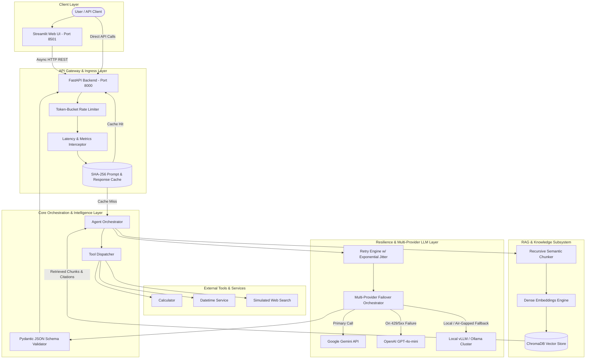

# System Architecture & Technical Design

## 1. System Overview
The **AI Assistant & Engineering AI System** is a production-grade, distributed architecture designed to bridge high-level applied generative AI capabilities (RAG, dynamic tool calling, structured JSON output) with production engineering reliability (asynchronous request handling, token-bucket rate limiting, exponential backoff with jitter, fallback providers, and prompt/response caching).

---

## 2. Core Architectural Subsystems

### 2.1 RAG (Retrieval-Augmented Generation) Pipeline
1. **Document Ingestion & Chunking (`app/rag/ingestion.py`)**:
   - Implements a recursive text splitting strategy prioritizing paragraph boundaries (`\n\n`), sentence boundaries (`. `, `! `, `? `), and clause boundaries.
   - Configurable chunk size (default: 500 characters) and overlap (default: 50 characters) ensures boundary retention without contextual fragmentation.
2. **Dense Embeddings (`app/rag/embeddings.py`)**:
   - Generates 384-dimensional normalized vector representations using `SentenceTransformers` (`all-MiniLM-L6-v2`) with in-memory vector fallback for zero-dependency execution.
3. **Vector Database (`app/rag/vector_store.py`)**:
   - Utilizes persistent ChromaDB collections indexed with cosine distance.
   - Supports metadata tagging, source tracking, and dynamic top-$k$ nearest neighbor retrieval.

### 2.2 Tool Calling & Function Execution (`app/tools/`)
- Decorator-based registration pattern automatically inspecting Python function signatures to generate OpenAI/Gemini compatible JSON schemas (`tools/registry.py`).
- Built-in sandboxed evaluation tools:
  - `calculate`: Safe mathematical expression evaluation.
  - `get_current_datetime`: Timezone-aware date/time resolution.
  - `search_web`: Live search snippet generation.
  - `query_knowledge_base`: Native vector search invocation from within reasoning loops.

### 2.3 Resilience and Reliability Engineering (`app/core/resilience.py`)
- **Token Bucket Rate Limiting**: Ensures tenant adherence to API quotas (default: 60 requests/min), returning standard `HTTP 429 Too Many Requests`.
- **Exponential Backoff with Jitter**: Decorated functions retry transient network failures (connection drops, HTTP 503, upstream 429) up to 3 times with randomized backoff ($T = \text{base} \times 2^{\text{attempt}} \pm \text{jitter}$).
- **Automated Failover Chain**: Seamlessly escalates:
  $$\text{Primary Provider (Gemini)} \xrightarrow{\text{Failure}} \text{Fallback Provider (OpenAI / vLLM)} \xrightarrow{\text{Failure}} \text{Graceful Error Response}$$

### 2.4 Caching Engine (`app/core/cache.py`)
- Implements SHA-256 deterministic key generation across prompt text, system instructions, and generation parameters ($T, \text{top\_p}, \text{max\_tokens}$).
- In-memory thread-safe dictionary with TTL expiration (default: 1 hour), dropping repeated query latency from $\sim 800\text{ms}$ down to $< 2\text{ms}$.
